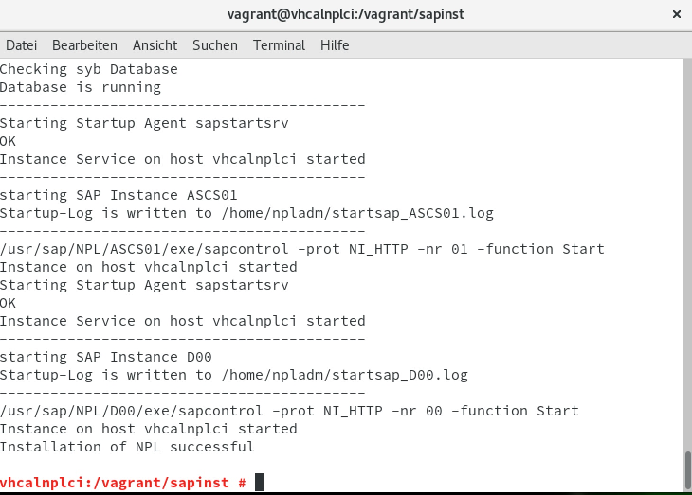

Introduction
============
The openSUSE Leap 42.3 box can be used to create a VirtualBox instance with Vagrant to install [SAP NW AS ABAP 751 SP02 Developer Edition](https://blogs.sap.com/2017/09/04/sap-as-abap-751-sp02-developer-edition-to-download/) .
 
 All recommended system preparations will be done by packer and vagrant, as described at [Installing ABAP AS on Oracle VirtualBox](https://blogs.sap.com/2017/09/04/newbies-guide-installing-abap-as-751-sp02-on-linux/) without the proxy part (step C.3.).

 The step D.1. ***sudo -i*** and ***FINALLY, we run the installation, by entering the command ./install.sh*** must be done manually!
 
 # no maintenance anymore
 
 ## Please also take a look at the new project SAPNW752SP01
 [wechris/SAPNW752SP01](https://github.com/wechris/SAPNW752SP01)
 
Prerequisites
=============
 
On OS X Packer, VirtualBox and Vagrant is available via [Homebrew](http://brew.sh/) on Windows via [Chocolatey](https://chocolatey.org).

OS X: 
```
$ brew install packer
$ brew install virtualbox
$ brew install vagrant
```
optional:
```
$ brew install vagrant-manager
```
 
Usage
=====
Clone the reporitory [wechris/SAPNW751SPS02](https://github.com/wechris/SAPNW751SPS02). 

Download and extract the [sap_netweaver_as_abap_751_sp02_ase_dev_edition.partX.rar](https://tools.hana.ondemand.com/#abap) files to the folder: *./sapinst*

The actual download (in the form of several .rar files), along with more information, is available here:

[SAPStore: ABAP 7.50](https://store.sap.com/sap/cp/ui/resources/store/html/SolutionDetails.html?pid=0000014492&catID=&pcntry=DE&sap-language=EN&_cp_id=id-1477346420741-0)

```
./sapinst/sap_netweaver_as_abap_751_sp02_ase_dev_edition
```

**Packer** 
```
cd packer
cd openSUSE-42.3
$ packer build -only=virtualbox-iso template.json
```
 
**Vagrant**

Only VirtualBox:

If the german keyboard is not desired, comment the following line in the vagrant file
````
# config.vm.provision "shell", path: "install/changetogerman.sh"
````
If the gnome desktop is not desired, comment the following line in the vagrant file
````
# config.vm.provision "shell", path: "install/gnome.sh"
````

```
cd ../../
vagrant up --provision
```

Wait until the vagrant command is finished. Then restart the instance with:
```
vagrant reload
```


**Login**

Login: vagrant/vagrant.

**Install SAP NW AS ABAP 751 SP02 Developer Edition**

The files and folder, on the same level as the vagrant file, will be available under /vagrant
````
sudo -i
<enter pwd>
cd /vagrant
./install.sh
````
Installation options:

* ./install.sh – installs the Developer Edition in dark mode, the installer will configure the SAP system for usage of the physical hostname
* ./install.sh -g– will present you a SAPINST GUI allowing you to modify certain system parameters
* ./install.sh -h <own hostname>– allows you to specify your own hostname to be used by the SAP system
* ./install.sh -s – allows you to skip the hostname check )

Read and accept the license agreement.
When prompted for the OS users password enter your master password of the virtual Linux OS instance.

Start the SAP system:
- Switch to user npladm in the console : **su npladm**
- Start the SAP system : **startsap ALL**



**Post and optional installation steps**

Additional informations, License key and first steps follow [SAP NW AS ABAP 7.51 SP2 – Developer Edition to Download: Concise Installation Guide](https://blogs.sap.com/2017/09/04/sap-as-abap-7.51-sp2-developer-edition-to-download-concise-installation-guide/)

Start/Stop the VBox with:
````
vagrant up
vagrant halt
````
or with the virtualbox UI.

